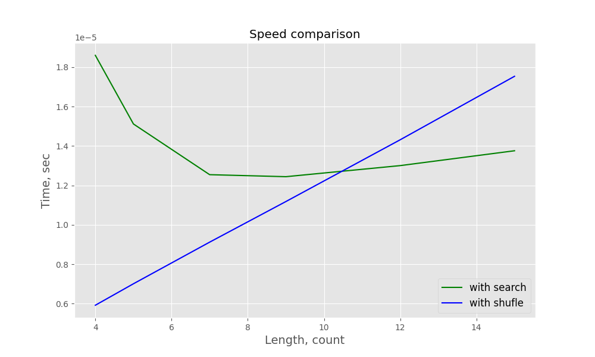
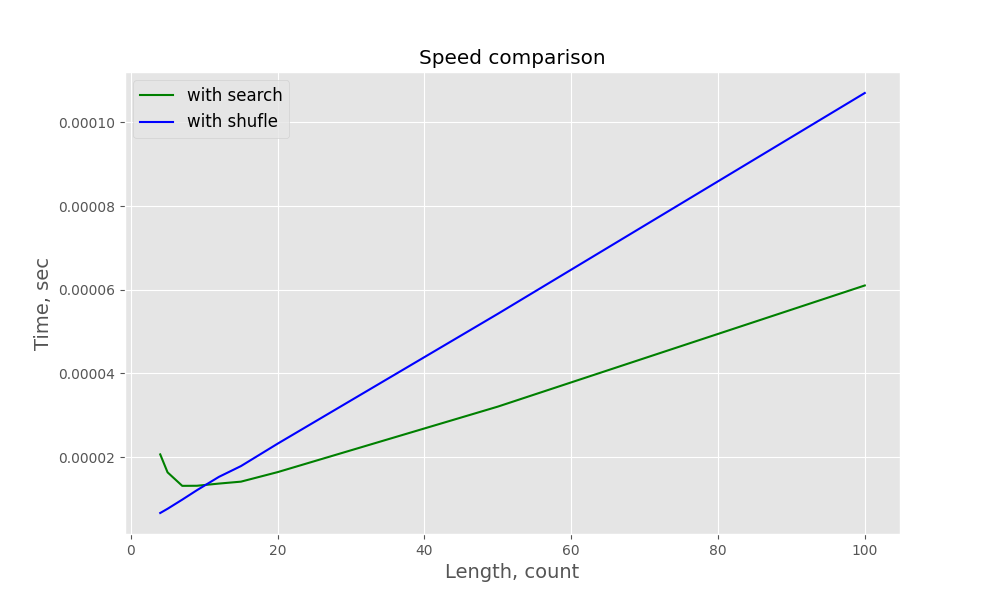
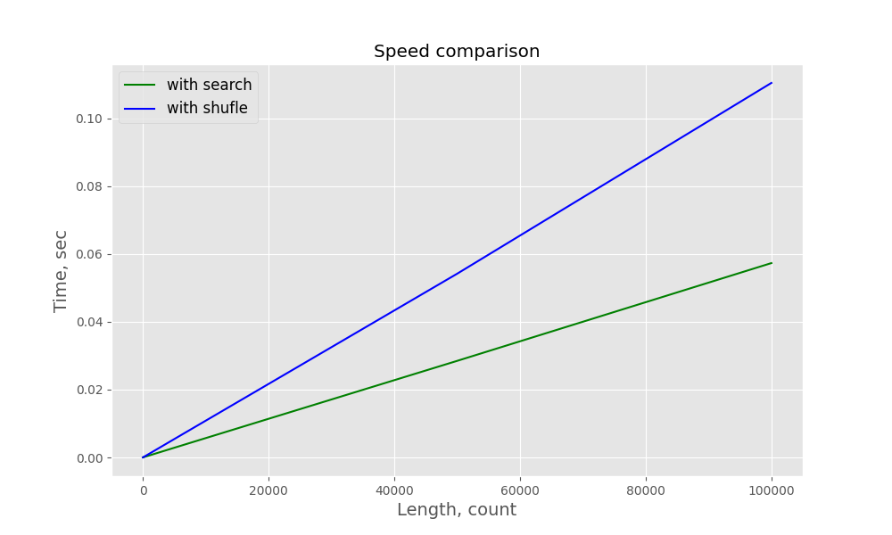

# Test task by Luxsoft. 30.01.2023
___
## Vacancy description => [Job vacation](https://career.luxoft.com/job/test-automation-engineer-50-manual-50-python/347488)

## Task:
> Program takes input from the user, which is a number.
This number is the length of the random strong password
which program needs to generate.PW should contain at
least 1 big letter, 1 small letter, 1 number and 1 special character.

For the password creation function to work correctly, you need ***at least 4 characters***.
So, we need to add an assert that verifies the value entered by the user(s).
Also we need to check the input value type, it should be ***integer***.
If these conditions are not met, the function returns : ``Wrong value of length. 
Must be int != {type(length)} and {length} >= 4``.

We can solve this task in two ways.

### Resolve № 1

For creating unique password we use ``random.shuffle()``.
1. Create password where:
    1. the first character is digit
    2. the second one is special character
    3. the third - small letter
    4. the fourth - big letter
    ```python
       alphabet = string.digits + string.ascii_uppercase + string.ascii_lowercase + string.punctuation
       password = f'{random.choice(string.digits)}{random.choice(string.ascii_lowercase)}' \
                  f'{random.choice(string.ascii_uppercase)}{random.choice(string.punctuation)}' \
                  f'{"".join([random.choice(alphabet) for _ in range(length - 4)])}'
    ```
2. Shuffle the letters in password
    ```python
       password_list = list(password)
       random.shuffle(password_list)
       return ''.join(password_list)
   ```

### Resolve № 2

To create a unique password, we use a search
by the first occurrence of a substring

1. Create random password from alphabet:
    ```python
        alphabet = string.digits + string.ascii_uppercase + string.ascii_lowercase + string.punctuation
        password = ''.join([random.choice(alphabet) for _ in range(length)])
    ```
2. Check password string:
    1. Does any digit in password?
    2. Does any special character in password?
    3. Does any uppercase letter in password?
    4. Does any lowercase letter in password?
    ```python
       if any(letter in password for letter in string.digits)
   ```
3. If one of the fourth answers is negative, make changes to the password:
   ```python
      return password[:index] + random.choice(values) + password[index + 1:]
   ```
   There are *index* = random value from 0 to password length, 
   *values* = string of digits/punctuation/lowercase/uppercase.
4. Until all the questions from the second point are positive, repeat the third point.

## Speed comparation of resolves

To compare solutions, we create 100 unique passwords of the same length.
We get the creation time and calculate the average password creation time.

### Length in [ 4 - 15 ]


### Length in [ 4 - 100 ]


### Length in [ 4 - 100000 ]


## Conclusion

For password length less than 11 - the best decision is ``random.shuffle()``. For another - search substring.